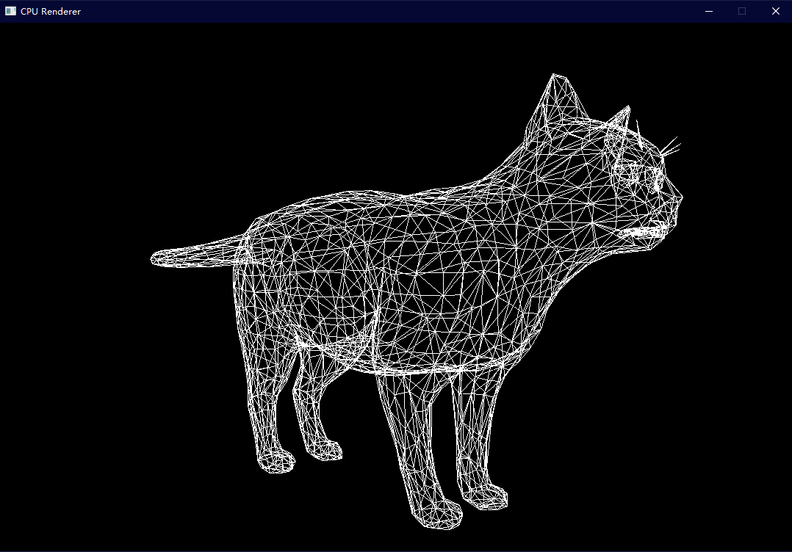
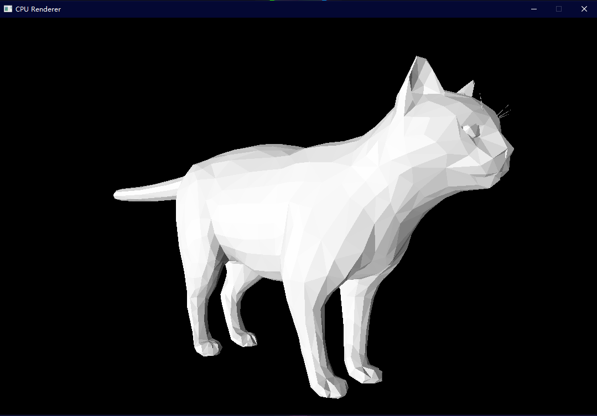
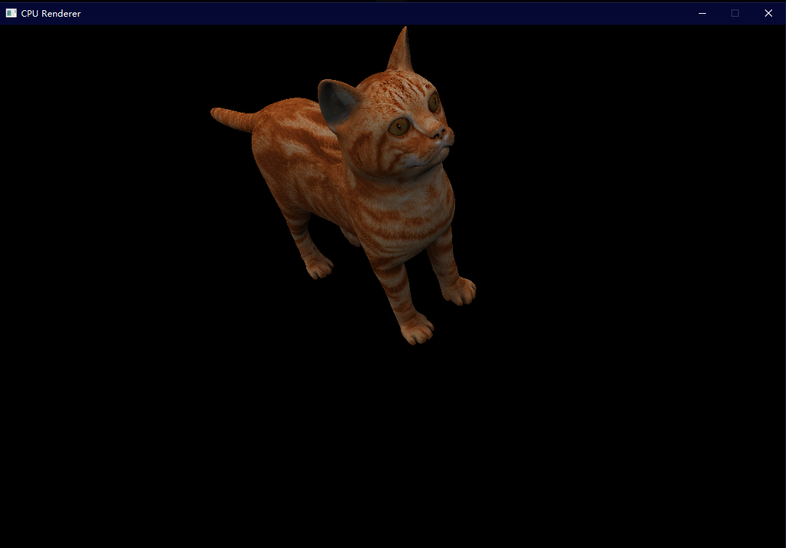

# CpuRenderer
A CPU Renderer implemented in C++.

## Build Project:

### MacOS/Unix need install dependency first:
```
brew install sdl2
```

### VS/Unix:
```
mkdir build
cd build
cmake ..
```

### Xcode:
```
mkdir build
cd build
cmake -G "Xcode" ..
```

## Build Binary Then Run(should build project first):
```
(working directory: build)
cmake --build . --target install
cd ../bin
./CpuRenderer
```

## more info about this project:
[How to implement a CPU Renderer](https://johnyoung404.github.io/2020/06/16/%E5%AE%9E%E7%8E%B0%E4%B8%80%E4%B8%AA%E8%BD%AF%E6%B8%B2%E6%9F%93%E5%99%A8(CPU-Renderer)/)

## Gallery

Check out `gallery` folder if image links fail:




