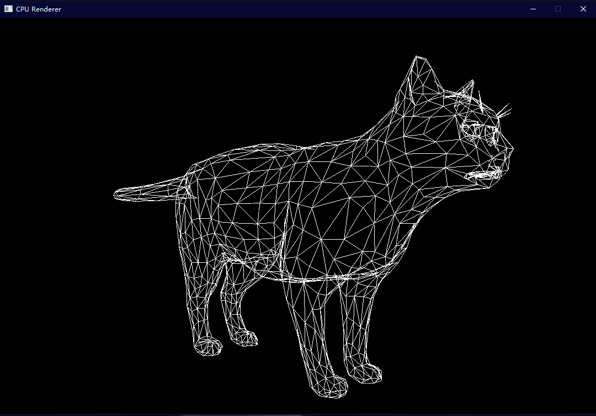

# CpuRenderer
A CPU Renderer implemented in C++.

## Build Project:

### MacOS/Unix need install dependency first:
```
brew install sdl2
```

### VS/Unix:
```
mkdir build
cd build
cmake ..
```

### Xcode:
```
mkdir build
cd build
cmake -G "Xcode" ..
```

## Build Binary Then Run(should build project first):
```
(working directory: build)
cmake --build . --target install
cd ../bin
./CpuRenderer
```

## Gallery




